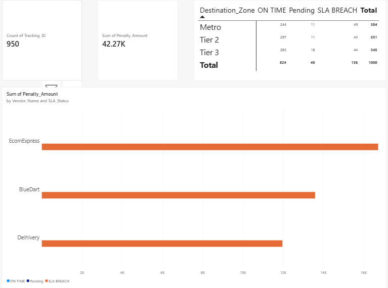

# Multi-Vendor Logistics SLA & Revenue Leakage Analysis

## Executive Summary
This project analyzes **1,000 shipment records** across three major logistics partners (**BlueDart, Delhivery, EcomExpress**) to measure Service Level Agreement (SLA) compliance and quantify financial exposure caused by delayed deliveries. Using custom business-day logic, zone-based target mapping, and automated penalty modeling across both Excel and Power BI, this analysis identifies operational bottlenecks and revenue leakage.

---

## Key Metrics & Findings

* **Overall Breach Rate:** **28.40%** of total shipments failed to meet targeted SLA delivery timelines.
* **Total Penalty Liability:** Generated **₹89,448.85** in total financial claims across all breach instances.
* **Best Delivery Compliance:** **Delhivery** recorded the highest on-time delivery rate at **69.53%**.
* **Highest Financial Exposure:** **EcomExpress** registered the highest SLA breach rate at **30.45%**, driving **₹32,756.55** in penalty liabilities.

---

## Data Pipeline & Modeling Logic

### 1. Data Processing & Excel Modeling
* **Business Days Calculation:** Excluded weekends to determine actual transit time:
  `Actual Business Days = NETWORKDAYS(Dispatch_Date, Delivery_Date)`
* **Zone-Based SLA Targets:** Mapped tier-specific delivery benchmarks:
  * **Metro:** 2 Days
  * **Tier 2:** 4 Days
  * **Tier 3:** 5 Days
* **Automated Breach Flagging:** Marked status dynamically as `ON TIME`, `SLA BREACH`, or `Pending`.
* **Penalty Quantification:** Evaluated penalty claims based on breach status and order value.

### 2. Power BI DAX Implementation
* **Actual Business Days:** Excluded weekends dynamically using `CALENDAR` and `WEEKDAY` filtering.
* **Dynamic SLA Targets:** Applied `SWITCH(TRUE())` logic to assign SLA windows based on destination tier (Metro: 2 days, Tier 2: 4 days, Tier 3: 5 days).
* **Breach & Penalty Modeling:** Conditioned `SLA_Status` based on delivery timelines and calculated a 5% financial penalty on order values for breached shipments.

---

## Executive Dashboard Features



* **KPI Cards:** Top-level executive metrics highlighting total counted order shipments (**950 delivered**, 50 pending) and total financial breach penalty claims (**₹42.27K**).
* **Vendor Performance Chart:** Clustered horizontal bar chart breaking down total penalty values across delivery partners (**EcomExpress**, **BlueDart**, **Delhivery**).
* **Regional Matrix Table:** Cross-tabulation table aggregating shipment volumes by destination zone (**Metro**, **Tier 2**, **Tier 3**) across delivery statuses.

---

## Repository Structure

```text
Multi-Vendor Logistics SLA & Revenue Leakage Analysis/
│
├── 01_Raw_Data.ipynb          # Jupyter Notebook for raw data extraction/generation
├── Raw_Logistics_Data.csv     # Ingested raw logistics dataset
├── 02_Excel_Model.xlsx        # Advanced Excel financial model & interactive dashboard
├── 03_PowerBI_Dashboard.pbix  # Power BI interactive report & DAX modeling file
├── PowerBI_Dashboard.png      # Screenshot of interactive Power BI dashboard
└── README.md                  # Project documentation
